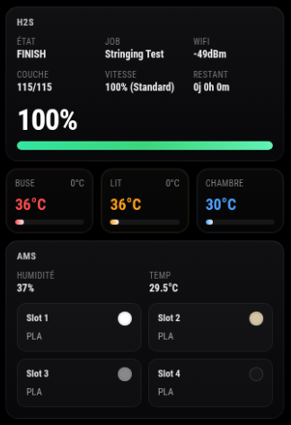

# Bambulink Module for MagicMirror [](https://raw.githubusercontent.com/TAGinside/MMM-Bambulink/main/LICENSE)
Module: MMM-Bambulink

This [MagicMirror](https://github.com/MagicMirrorOrg/MagicMirror) module,

MMM-Bambulink is a third-party module for MagicMirror² designed to display information about your Bambu Lab printer directly on your MagicMirror screen. The module connects to your printer over the local network using Bambu Lab’s LAN credentials and updates information automatically at a configurable interval.

> **Important: ONLY LAN mode NOT must be enabled on the printer.**



## Requirements

To use this module, you need the following information:

- The IP address of your Bambu Lab printer
- The printer’s LAN Access Code
- The printer serial number

These three values are required in the configuration to establish the connection with your printer. MagicMirror² documentation recommends clearly listing required external dependencies and setup information in a module README. 

## Key Features

- Monitor your Bambu Lab printer directly from MagicMirror². 
- Secure local connection using **MQTT/TLS** on port **8883**.
- Configurable refresh interval for automatic updates.
- Custom printer title using the `printerModel` option.
- Two temperature display modes:
  - **tile view** (`tiles`)
  - **graph view** (`graph`)
- Visual **AMS** display including:
  - AMS temperature,
  - filament color,
  - loaded filament type for each slot.
- Automatic highlight of the **active AMS slot** during printing, including when the printer switches filament. Bambu’s AMS workflow is built around slot-based filament selection and color mapping, which makes this type of visual highlighting consistent with how AMS data is handled in local workflows. 
- Simple installation inside the standard MagicMirror² module structure. 

## Development Status

The module is functional and ready to use in a standard MagicMirror² environment. Installation, Node.js dependencies, configuration, and update steps follow the usual module workflow inside `~/MagicMirror/modules`, which is the standard location for third-party MagicMirror² modules. 

The project is still evolving, especially in terms of UI improvements, advanced display options, and visual customization.

You can support my work here -> <a href="https://buymeacoffee.com/taginside"></a>

## Compatibility

MMM-Bambulink is designed for **MagicMirror²** and **Bambu Lab printers** without **LAN mode enabled**.

The required parameters such as `ip`, `accessCode`, `serial`, `mqttPort`, and `useTLS` indicate that the module is intended to communicate with the printer locally through a secure network connection. 

## Installation

Go to your MagicMirror `modules` directory:

```bash
cd ~/MagicMirror/modules
```

Clone the repository:

```bash
git clone https://github.com/TAGinside/MMM-Bambulink
```

Enter the module directory:

```bash
cd MMM-Bambulink
```

Install the Node.js dependencies:

```bash
npm install
```


## Configuration

Add the module to the `modules` array in your `config/config.js` file:

```javascript
  {
    module: "MMM-Bambulink",
    position: "top_left",
    config: {
      ip: "192.168.1.x",                // Printer IP address
      accessCode: "xxxxxxxx",           // LAN Access Code
      serial: "XXXXXXXX",               // Printer serial number
      updateInterval: 5000,             // Refresh interval in ms

      printerModel: "H2S",              // Displayed printer name or model
      temperatureDisplayMode: "tiles",  // "tiles" or "graph"

      display: {
        scale: 1,
        width: 320,
        graphMinutes: 1
      },

      temperatureColors: {
        nozzle: "#ff4d4f",              // Red
        bed: "#ff9f1a",                 // Orange
        chamber: "#4da3ff"              // Blue
      }
    }
  },
```

MagicMirror² modules are configured through `config/config.js`, where each module is added to the `modules` array with its own `config` object.

## How to Use

After adding the module to `config/config.js`, restart MagicMirror².

Once running, the module will display your Bambu Lab printer information in the selected MagicMirror position, such as `top_left`, using the temperature display mode you configured.

## Update

To update the module:

```bash
cd ~/MagicMirror/modules/MMM-Bambulink
git pull
npm ci
```

Then restart MagicMirror².

You can support my work here -> 
[Buymeacoffee](https://buymeacoffee.com/taginside)

## Use Cases

MMM-Bambulink is especially useful in:

- a workshop,
- a technical office,
- a home lab,
- a smart home dashboard centered around MagicMirror².

It allows you to quickly monitor an active print, confirm that the printer is responding, and keep a live visual overview of the current job without constantly opening Bambu Studio.

## About

The module is open source and free to use and modify.

Feedback is always welcome, especially for printer compatibility, AMS behavior, and display improvements.
